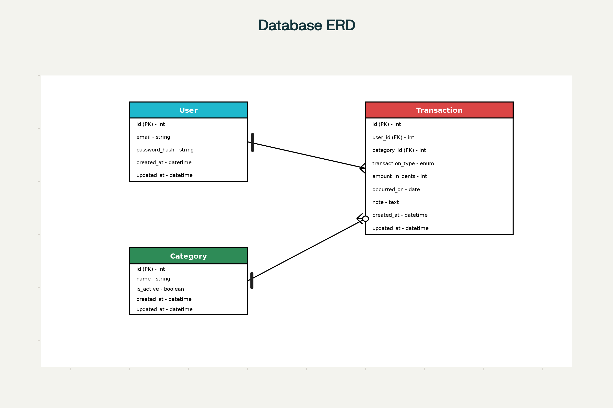

Ledgerly 

A simple Django + Postgres web app to record incomes and outgoings and show a weekly “available to spend” total. Built for clarity, speed, and a small, focused MVP, with room for future insights like average spend and a lightweight blog.

Table of Contents
Overview

Problem

Solution

Scope

MVP

Ideation

Information Architecture

User Stories

Tech Stack

Setup

Roadmap

Contributing

License

Overview
Weekwise Budget helps users understand what they can safely spend this week by combining all recorded incomes and outgoings into one clear number. The app focuses on minimal screens, fast entry, and accurate calculations.

Problem
Budget tools can feel heavy or too granular. Many people just want one trusted weekly number without spreadsheets or manual sums.

Solution
Quick forms for incomes and outgoings.

<p align="center">
	
	
	
	
	<a href="https://github.com/users/JakeyMarsh1/projects/9/views/1"></a>
</p>

# Ledgerly

A simple Django + Postgres web app to record incomes and outgoings, showing a weekly “available to spend” total. Built for clarity, speed, and a focused MVP, with room for future insights like average spend and a lightweight blog.

---

## Table of Contents
- [Overview](#overview)
- [Problem](#problem)
- [Solution](#solution)
- [Scope](#scope)
- [MVP](#mvp)
- [Ideation](#ideation)
- [Information Architecture](#information-architecture)
- [User Stories](#user-stories)
- [Tech Stack](#tech-stack)
- [Setup](#setup)
- [Roadmap](#roadmap)
- [Contributing](#contributing)
- [License](#license)

---

## Overview
Ledgerly helps users understand what they can safely spend this week by combining all recorded incomes and outgoings into one clear number. The app focuses on minimal screens, fast entry, and accurate calculations.

## Problem
Budget tools can feel heavy or too granular. Many people just want one trusted weekly number without spreadsheets or manual sums.

## Solution
- Quick forms for incomes and outgoings
- One weekly “available to spend” total on the dashboard
- Simple categories to keep organization lightweight

## Scope
**In scope (MVP):**
- Transaction CRUD (income and outgoing)
- Weekly available total on a dashboard
- Basic auth (sign up/in/out)
- Simple categories for outgoings
- Django Admin for support tasks

**Out of scope (for now):**
- CSV import/export
- Attachments/receipts
- Blog
- Average spending insights and projections

---

## MVP
The MVP delivers:
- Dashboard with “available to spend” for the current week
- Add/edit/delete incomes and outgoings
- Recent transactions list
- Secure per-user data isolation

**Success criteria:**
- Entering a transaction updates the weekly total immediately
- Core pages are simple to navigate and responsive

## Ideation
**Principles:**
- Keep actions to two clicks where possible
- Store money in integer pence; format at the view layer
- Start server-rendered; add charts/CSV later
- Write stories in “As a role, I can capability, so that benefit” format

**Why weekly?**
A single weekly number reduces cognitive load and supports everyday decisions.

## Information Architecture
- **Dashboard:** weekly total and a small summary
- **Transactions:** list, add income, add outgoing, edit/delete
- **Categories:** simple admin-managed list; dropdown on outgoing form
- **Auth:** sign up, log in, log out


---

## Entity Relationship Diagram (ERD)
### Visual ERD



This diagram represents the relationships between the `User`, `Transaction`, and `Category` entities. Each `User` can have multiple `Transactions`, while each `Transaction` optionally belongs to a `Category`. Categories are shared globally and not user-specific.

### User
| Attribute      | Type         | Notes                                      |
|---------------|--------------|--------------------------------------------|
| id            | PK           | Unique identifier for the user.            |
| email         | String (unique) | Used for login; unique per user.           |
| password_hash | String       | Stored securely by auth system.            |
| created_at    | DateTime     | Record creation timestamp.                 |
| updated_at    | DateTime     | Last update timestamp.                     |

**Relationships:**
- User to Transaction: 1 to many (One User has many Transactions; each Transaction belongs to exactly one User)
- User to Category: none (Categories are global/shared; not owned by a specific User in the MVP)

### Category
| Attribute   | Type   | Notes                                         |
|-------------|--------|-----------------------------------------------|
| id          | PK     | Unique identifier for the category.           |
| name        | String | Display name (e.g., Groceries, Rent).         |
| is_active   | Boolean| Controls availability in forms.               |
| created_at  | DateTime | Record creation timestamp.                   |
| updated_at  | DateTime | Last update timestamp.                       |

**Relationships:**
- Category to Transaction: 1 to many (One Category is used by many Transactions)
- Category on INCOME: optional (For INCOME rows, category is null)
- Category on OUTGO: required (For OUTGO rows, category is required)

### Transaction
| Attribute        | Type                | Notes                                              |
|------------------|---------------------|----------------------------------------------------|
| id               | PK                  | Unique identifier for the transaction.              |
| user_id          | FK -> User(id)      | Owner; required.                                   |
| category_id      | FK -> Category(id), nullable | Required for OUTGO; null for INCOME.      |
| type             | Enum {INCOME, OUTGO}| Controls sign/behavior.                            |
| amount_in_cents  | Integer             | Store money in minor units for precision.           |
| occurred_on      | Date                | The transaction date (used for weekly grouping).    |
| note             | Text (optional)     | Freeform context.                                  |
| created_at       | DateTime            | Record creation timestamp.                         |
| updated_at       | DateTime            | Last update timestamp.                             |

**Relationships:**
- Transaction to User: many to 1 (Each Transaction belongs to exactly one User)
- Transaction to Category: many to 1 (optional) (Optional for INCOME; required for OUTGO)

---
## User Stories
All current user stories are tracked on the project board:  
[User Stories & Project Board](https://github.com/users/JakeyMarsh1/projects/9/views/1)

## Tech Stack
- **Backend:** Django (Python), Django Admin
- **Database:** PostgreSQL
- **Templating:** Django templates; minimal JS (Chart.js later)
- **Auth:** Django auth (email login optional)

## Setup
**Requirements:** Python 3.11+, PostgreSQL 14+

**Steps:**
1. Clone the repo and create a virtualenv
2. Install dependencies: `pip install -r requirements.txt`
3. Configure environment variables (`DATABASE_URL`, `SECRET_KEY`, `DEBUG`)
4. Run migrations: `python manage.py migrate`
5. Create a superuser: `python manage.py createsuperuser`
6. Start the server: `python manage.py runserver`

## Roadmap
- **MVP:** dashboard, transaction CRUD, auth, admin
- **Post‑MVP:** CSV import/export, attachments, average-spend insights, optional blog

## Contributing
- Open an issue or small PR
- Use feature branches and concise commit messages
- Add a simple test for each change

## License
Specify a license (e.g., MIT) in LICENSE

---

# Suggested Django Project Structure for Ledgerly

```
ledgerly/
├── ledgerly/                  # Project config (settings, urls, wsgi)
│   ├── __init__.py
│   ├── settings.py
│   ├── urls.py
│   ├── wsgi.py
│   └── asgi.py
├── expenses/                  # Your main app (can be named 'expenses', 'core', etc.)
│   ├── __init__.py
│   ├── admin.py               # Register models for Django admin
│   ├── apps.py
│   ├── models.py              # User, Transaction, Category models
│   ├── views.py               # Views for dashboard, CRUD, etc.
│   ├── urls.py                # App-specific URLs
│   ├── forms.py               # Django forms for input
│   ├── tests.py               # Unit tests
│   ├── migrations/
│   │   └── __init__.py
│   └── templates/
│       └── expenses/
│           ├── dashboard.html
│           ├── transaction_list.html
│           └── ...           # Other templates
├── manage.py
├── requirements.txt
└── README.md
```

- Place your custom User model (if needed) and Transaction/Category models in `expenses/models.py`.
- Use `expenses/views.py` for dashboard and CRUD logic.
- Templates go in `expenses/templates/expenses/`.
- Register your app in `INSTALLED_APPS` in `ledgerly/settings.py`.