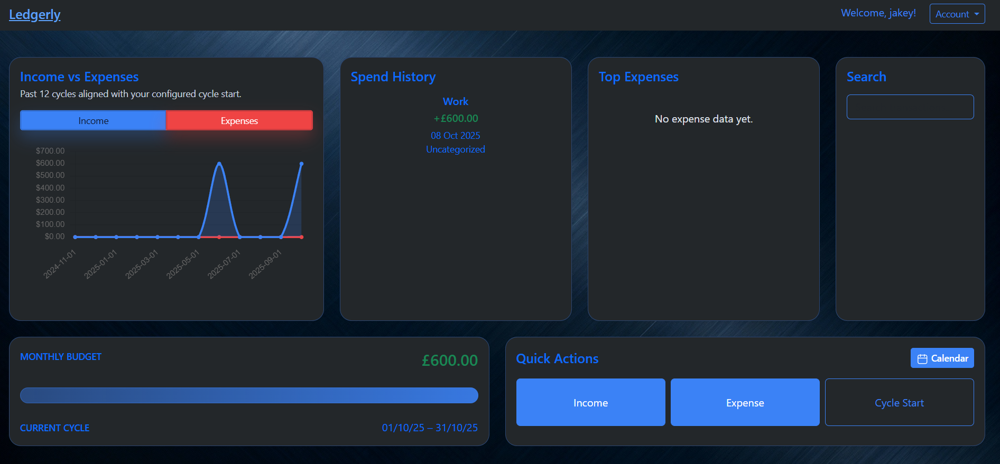
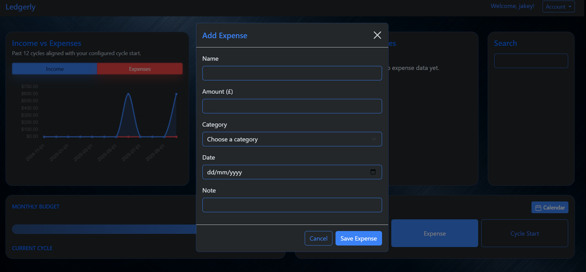
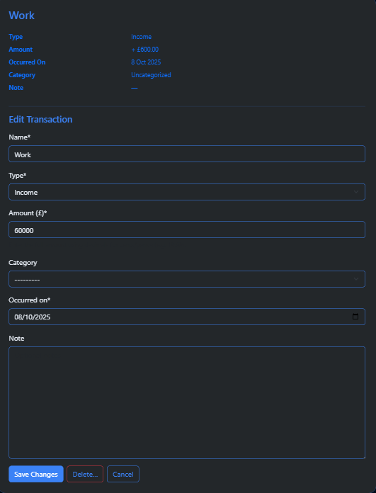
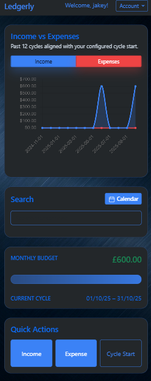
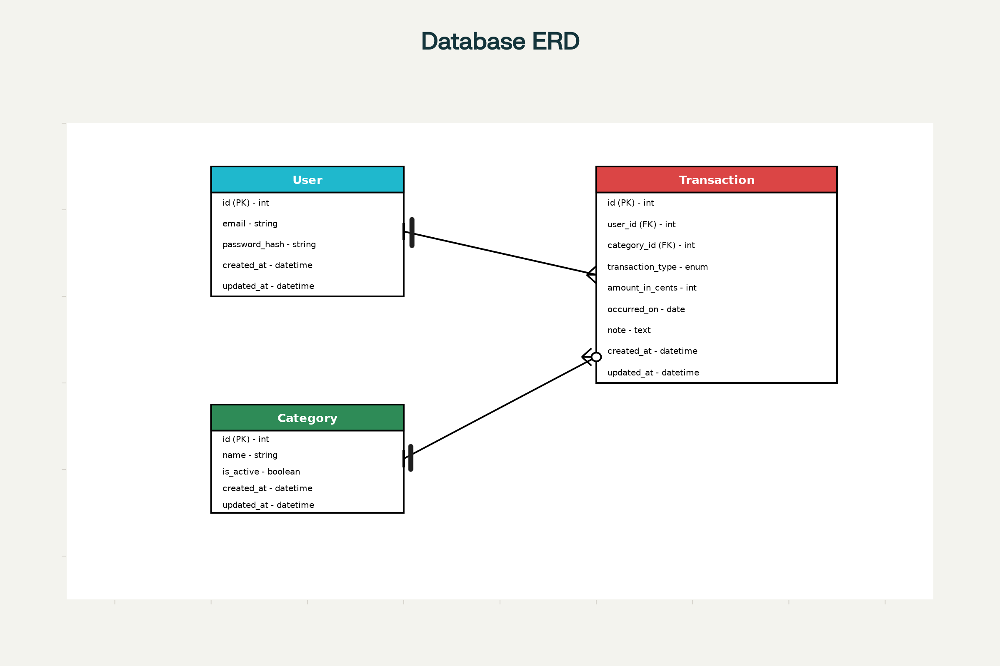

<p align="center">


<a href="https://github.com/users/JakeyMarsh1/projects/9/views/1"></a>
</p>

# Ledgerly

Ledgerly is a simple Django + Postgres web app to record incomes and outgoings, showing a monthly “available to spend” total. Built for clarity, speed, and a focused MVP, with room for future insights like average spend.

---

## Table of Contents

- [Overview](#overview)
- [Features](#features)
- [Accessibility](#accessibility)
- [Screenshots](#screenshots)
- [Wireframe](#wireframe)
- [Entity Relationship Diagram (ERD)](#entity-relationship-diagram-erd)
- [Information Architecture](#information-architecture)
- [User Experience Design](#user-experience-design)
- [User Stories](#user-stories)
- [Epics](#epics)
- [Agile Development](#agile-development)
- [Tech Stack](#tech-stack)
- [Project Structure](#project-structure)
- [Setup & Deployment](#setup--deployment)
- [Testing](#testing)
- [Known Issues, Assumptions & Limitations](#known-issues-assumptions--limitations)
- [Roadmap](#roadmap)
- [Contributing](#contributing)
- [Usage of AI](#usage-of-ai)
- [Credits](#credits)
- [License](#license)

---

## Overview

Ledgerly helps users understand what they can safely spend this month by combining all recorded incomes and outgoings into one clear number. The app focuses on minimal screens, fast entry, and accurate calculations.

---

## Features

- Dashboard: shows current-month “available to spend” and recent transactions.
- Transactions: add, edit, and delete incomes and outgoings.
- Categories: global list; required for outgoings, optional for incomes.
- Authentication: sign up, log in, log out; per-user data isolation.
- Data integrity: store money in integer pence; format in views/templates.

---

## Accessibility

- Semantic structure: headings, labels, and descriptive button text for assistive tech.
- Keyboard navigation: all interactive elements are reachable via Tab with a visible focus outline.
- Color and contrast: palette chosen to target WCAG AA contrast for text and controls.
- Forms: inputs have associated labels; errors and status messages are announced near the form heading.
- Touch targets: primary actions sized for comfortable tapping on mobile (approx. 44px minimum).
- Motion and feedback: no auto-playing or flashing content; feedback uses simple text alerts.

---

## Screenshots


| Dashboard | Add Outgoing | Transactions | Dashboard Mobile |
|-----------|--------------|--------------|-----------------|
|  |  |  |  |

---

## Wireframe


This wireframe shows the planned layout and user flow for the Ledgerly dashboard and transaction screens.

---

## Entity Relationship Diagram (ERD)



This diagram represents the relationships between the `User`, `Transaction`, and `Category` entities. Each `User` can have multiple `Transactions`, while each `Transaction` optionally belongs to a `Category`. Categories are shared globally and not user-specific.

**User**

| Attribute      | Type             | Notes                                    |
|----------------|------------------|------------------------------------------|
| id             | PK               | Unique identifier for the user           |
| email          | String (unique)  | Used for login; unique per user          |
| password_hash  | String           | Stored securely by auth system           |
| created_at     | DateTime         | Record creation timestamp                |
| updated_at     | DateTime         | Last update timestamp                    |

**Category**

| Attribute   | Type     | Notes                                   |
|-------------|----------|-----------------------------------------|
| id          | PK       | Unique identifier for the category      |
| name        | String   | Display name (e.g., Groceries, Rent)    |
| is_active   | Boolean  | Controls availability in forms          |
| created_at  | DateTime | Record creation timestamp               |
| updated_at  | DateTime | Last update timestamp                   |

**Transaction**

| Attribute        | Type                | Notes                                  |
|------------------|---------------------|----------------------------------------|
| id               | PK                  | Unique identifier for the transaction  |
| user_id          | FK -> User(id)      | Owner; required                        |
| category_id      | FK -> Category(id), nullable | Required for OUTGO; null for INCOME |
| type             | Enum {INCOME, OUTGO}| Controls sign/behavior                 |
| amount_in_cents  | Integer             | Store money in minor units for precision|
| occurred_on      | Date                | The transaction date                   |
| note             | Text (optional)     | Freeform context                       |
| created_at       | DateTime            | Record creation timestamp              |
| updated_at       | DateTime            | Last update timestamp                  |

---

## Information Architecture

- **Dashboard:** Monthly total and a small summary
- **Transactions:** List, add income, add outgoing, edit/delete
- **Categories:** Simple admin-managed list; dropdown on outgoing form
- **Auth:** Sign up, log in, log out

---

## User Experience Design

Ledgerly is designed for clarity, speed, and minimalism. The interface uses clear headings, accessible forms, and responsive layouts to ensure users can quickly understand and manage their finances. User stories below guided the design and development process.

---

## User Stories

**Delivered**

- As a user, I can view my “available to spend” total for the current week so that I immediately know what I can safely spend without overshooting my budget.
- As a user, I can record an income with amount and date (plus optional source and note) so that my inflows are accurately included in weekly availability.
- As a user, I can record an expense with amount, date, and category (plus optional note) so that my outflows are properly tracked and categorized.
- As a user, I can edit or delete my own transactions so that mistakes don’t distort my weekly availability or reports.
- As a user, I can see a paginated list of my recent transactions ordered by newest first so that I can quickly confirm entries and spot anomalies.
- As a user, I can create an account, sign in, and sign out so that my financial data remains private and secure.
- As an admin, I can browse, search, and edit users, categories, and transactions so that I can support users and keep data consistent.
- As a user, I can assign an active category to each outgoing so that my spending can be grouped for quick insights.

**Planned**

- As a user, I can filter transactions by week and category so that I can answer targeted spending questions.
- As a user, I can set my preferred weekly start day so that weekly availability matches how I plan my budget.
- As an admin, I can create default categories and archive categories so that users see a clean, relevant set.
- As an admin, I can view weekly counts of created, edited, and deleted transactions so that I can detect usability issues and training needs.
- As a user, I can attach receipts or files to a transaction so that I have evidence and context.
- As a user, I can import transactions from a CSV file so that I can batch-load my financial data efficiently.
- As a user, I can export my (filtered) transactions to CSV so that I can back up or analyze externally.
- As an admin, I can flag accounts as read-only demo users so that stakeholders can explore safely without changing data.

All current user stories are tracked on the [Project Board](https://github.com/users/JakeyMarsh1/projects/9/views/1).

---

## Epics

- **Secure access and data isolation:** Sign up, log in, log out; session-based access ensuring each user only sees their own data.
- **Weekly available-to-spend dashboard:** Single weekly total, recalculated immediately after transaction changes.
- **Transaction lifecycle:** Add income, add outgoing (with active category), edit/delete transactions, recent list with pagination.
- **Category administration:** Global categories with visibility controls; archived categories remain linked but hidden from forms.
- **Focused insights:** Filter by week and category; lightweight operational reporting (planned).
- **Admin management:** Browse/search/edit users, categories, transactions via Django Admin.
- **Data import/export and attachments:** CSV import/export and receipt/file attachments (planned).
- **Safe demo exploration:** Read-only demo users for stakeholder walkthroughs (planned).

---

## Agile Development

This project is managed using agile practices. User stories, tasks, and progress are tracked on the [Project Board](https://github.com/users/JakeyMarsh1/projects/9/views/1).  

I used the MoSCoW prioritization method to classify features and tasks:  
- **Must Have:** Essential for the MVP to function correctly (e.g., transaction CRUD, user authentication).  
- **Should Have:** Important but not critical for the MVP (e.g., category management, responsive design).  
- **Could Have:** Nice-to-have features that enhance user experience (e.g., CSV import/export, receipt attachments).  
- **Won't Have (for now):** Deferred features that may be revisited post-MVP (e.g., advanced analytics, social login).  

---

## Tech Stack

- **Backend:** Django (Python), Django Admin
- **Database:** PostgreSQL
- **Templating:** Django templates
- **Frontend:** Bootstrap (CSS), custom CSS (`style.css`, `metallic-bg.css`), custom JavaScript (`dashboard-chart.js`, `dashboard-search.js`)
- **Charts:** Chart.js (dashboard visualizations)
- **Authentication:** Django auth (email login optional)
- **Deployment:** Heroku
- **CI/CD:** GitHub Actions

---

## Project Structure

```
ledgerly/
├── ledgerly/                  # Project config (settings, urls, wsgi)
│   ├── __init__.py
│   ├── settings.py
│   ├── urls.py
│   ├── wsgi.py
│   └── asgi.py
├── expenses/                  # Your main app (can be named 'expenses', 'core', etc.)
│   ├── __init__.py
│   ├── admin.py               # Register models for Django admin
│   ├── apps.py
│   ├── models.py              # User, Transaction, Category models
│   ├── views.py               # Views for dashboard, CRUD, etc.
│   ├── urls.py                # App-specific URLs
│   ├── forms.py               # Django forms for input
│   ├── tests.py               # Unit tests
│   ├── migrations/
│   │   └── __init__.py
│   └── templates/
│       └── expenses/
│           ├── dashboard.html
│           ├── transaction_list.html
│           └── ...           # Other templates
├── manage.py
├── requirements.txt
└── README.md
```

- Place your custom User model (if needed) and Transaction/Category models in `expenses/models.py`.
- Use `expenses/views.py` for dashboard and CRUD logic.
- Templates go in `expenses/templates/expenses/`.
- Register your app in `INSTALLED_APPS` in `ledgerly/settings.py`.

---

## Setup & Deployment

**Requirements:** Python 3.11+, PostgreSQL 14+

### Local Setup

1. Clone the repo and create a virtualenv
2. Install dependencies:  
   `pip install -r requirements.txt`
3. Configure environment variables (`DATABASE_URL`, `SECRET_KEY`, `DEBUG`)
4. Run migrations:  
   `python manage.py migrate`
5. Create a superuser:  
   `python manage.py createsuperuser`
6. Start the server:  
   `python manage.py runserver`

### Heroku Deployment (via GitHub)

1. **Push to GitHub:**  
   Make sure all changes are committed and pushed to your main branch on GitHub.

2. **Connect Heroku to GitHub:**  
   In your Heroku dashboard, go to your app’s “Deploy” tab.  
   Under “Deployment method,” select **GitHub** and connect your repository.

3. **Set Config Vars:**  
   In the “Settings” tab, add your environment variables (e.g., `SECRET_KEY`, `DEBUG`, `ALLOWED_HOSTS`, `DATABASE_URL`, etc.) under “Config Vars.”

4. **Automatic Deploys:**  
   Enable “Automatic Deploys” from the main branch if you want Heroku to redeploy on every push.

5. **Manual Deploy:**  
   You can also trigger a manual deploy by clicking “Deploy Branch” in the Heroku dashboard.

6. **Static Files:**  
   Heroku will run `python manage.py collectstatic` automatically during the build process.  
   Make sure your `STATIC_ROOT` and `STATICFILES_STORAGE` are set correctly in `settings.py`.

7. **Database Migrations:**  
   After deployment, run migrations:
   ```bash
   heroku run python manage.py migrate
   ```

8. **Create Superuser (Optional):**  
   To access the Django admin panel:
   ```bash
   heroku run python manage.py createsuperuser
   ```

9. **Check Your App:**  
   Visit your Heroku app’s URL to confirm everything is working.

**Note:**  
- Make sure your `requirements.txt` and `Procfile` are up to date.
- If you use custom domains, configure them in the Heroku dashboard and set up DNS as needed.

**Example Heroku App:**  
[https://your-app-name.herokuapp.com/](https://your-app-name.herokuapp.com/)

---

## Testing

| Area          | Test                   | Steps                          | Expected                                   | Result |
|---------------|------------------------|--------------------------------|--------------------------------------------|--------|
| Auth          | Sign up                | Register a new account         | User created and logged in                 | ✅     |
| Auth          | Log in/out             | Log in, then log out           | Session starts/ends correctly              | ✅     |
| Transactions  | Add income             | Create income with valid data  | Appears in list; total updates             | ✅     |
| Transactions  | Add outgoing           | Create outgoing with category  | Appears in list; total updates             | ✅     |
| Transactions  | Edit                   | Edit an existing transaction   | Changes persist; total recalcs             | ✅     |
| Transactions  | Delete                 | Delete an existing transaction | Row removed; total recalcs                 | ✅     |
| Categories    | Validation             | Submit outgoing w/o category   | Form blocks submit with clear error        | ✅     |
| Dashboard     | Total recalculation    | Create/edit/delete transactions| “Available to spend” updates immediately   | ✅     |
| Security      | Data isolation         | Log in as second user          | Only that user’s data visible              | ✅     |
| Responsiveness| Mobile view            | Use a small viewport           | Layout remains readable and usable         | ✅     |

<!-- Example screenshot, replace with your own -->
<!--  -->

**Validator results:**  
- HTML: W3C Markup Validation Service — pass/notes  
- CSS: W3C CSS Validator — pass/notes  
- Python: linter (e.g., Ruff/Flake8) — pass/notes  
- JS: online linter (e.g., JSHint/ESLint) — pass/notes  

**Known bugs/fixes:**  
None observed in core flows during manual testing; will update as issues are reported.

---

## Known Issues, Assumptions & Limitations

- Validation messages may vary by browser defaults; ensure forms surface clear errors near the field and at the top of the form.
- Screenshot assets are placeholders until images are added under `assets/readme_images/`.
- No CSV import/export yet; large historical imports require manual entry for now.
- Category model is global; users cannot create private categories in the UI.
- Money stored as integer pence and formatted at the view/template layer to avoid floating‑point errors.
- Categories are shared across all users; OUTGO requires a category, INCOME does not.
- Weekly “available to spend” derives from current month context and recent transactions; advanced analytics deferred.
- Authentication relies on Django’s built‑in auth; no social login in MVP.

---

## Roadmap

- **MVP:** Dashboard, transaction CRUD, auth, admin
- **Post‑MVP:** CSV import/export, attachments, average-spend insights, optional blog

---

## Usage of AI

AI tools (such as GitHub Copilot and ChatGPT) were used to:
- Plan and refine user stories and acceptance criteria.
- Recommend and document the project’s file structure.
- Generate baseplate/boilerplate code for Django views and HTML templates.
- Debug code and suggest fixes for errors in Python, HTML, CSS, and JavaScript.
- Generate and refactor code for new features and improve accessibility.
- Perform automated code reviews and identify unused or duplicate code.
- Draft and polish documentation, including this README.

All code was reviewed and tested by the project owner before inclusion.

---

## Credits

- [Django](https://www.djangoproject.com/) — web framework
- [Bootstrap](https://getbootstrap.com/) — CSS framework
- [Chart.js](https://www.chartjs.org/) — charting library
- [Heroku](https://www.heroku.com/) — deployment platform

No proprietary or third-party code beyond these open-source libraries was used.